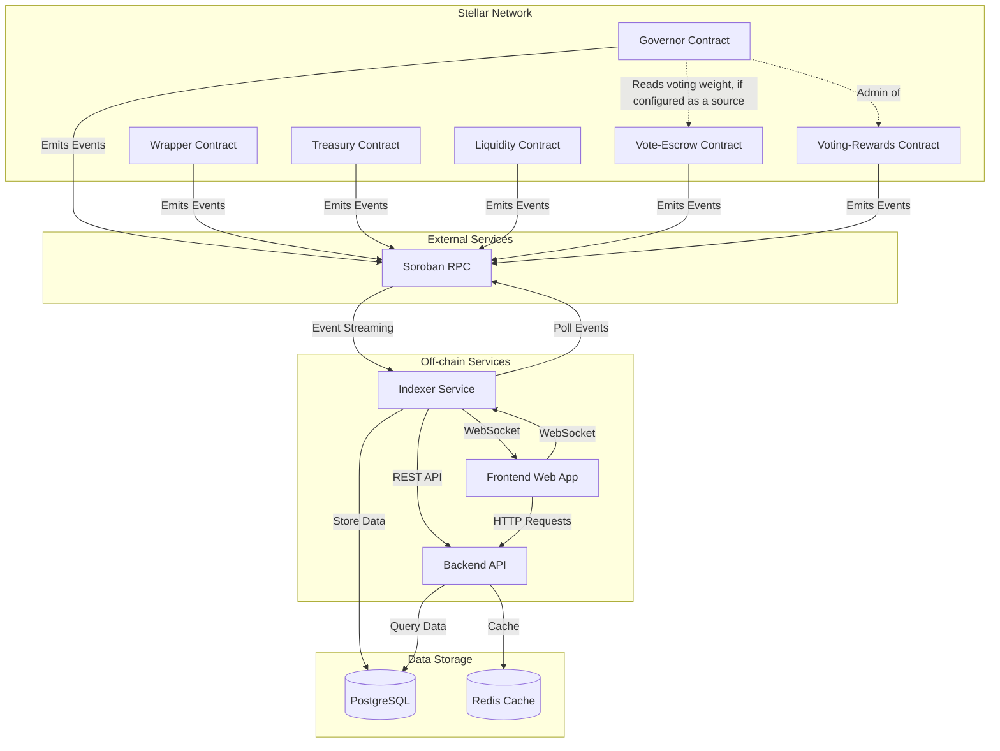
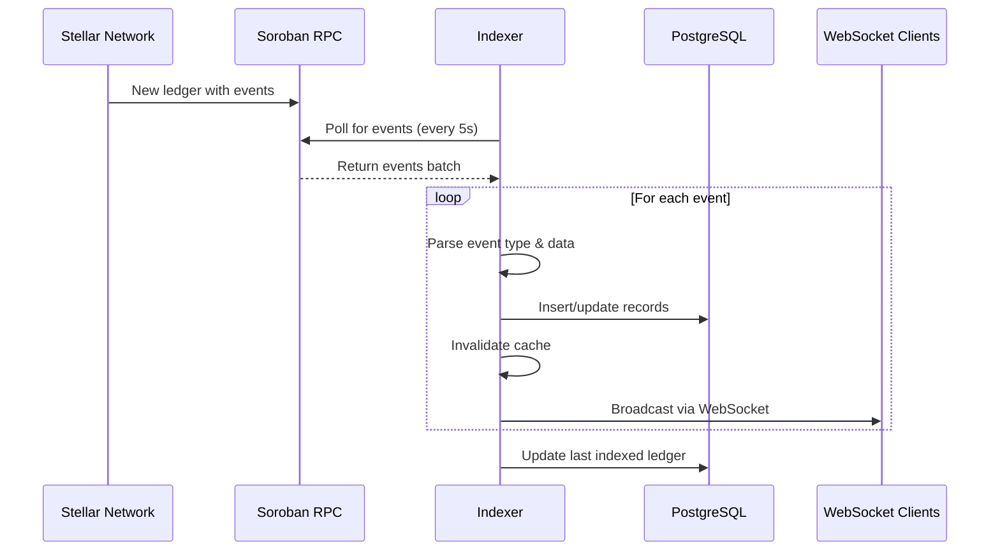
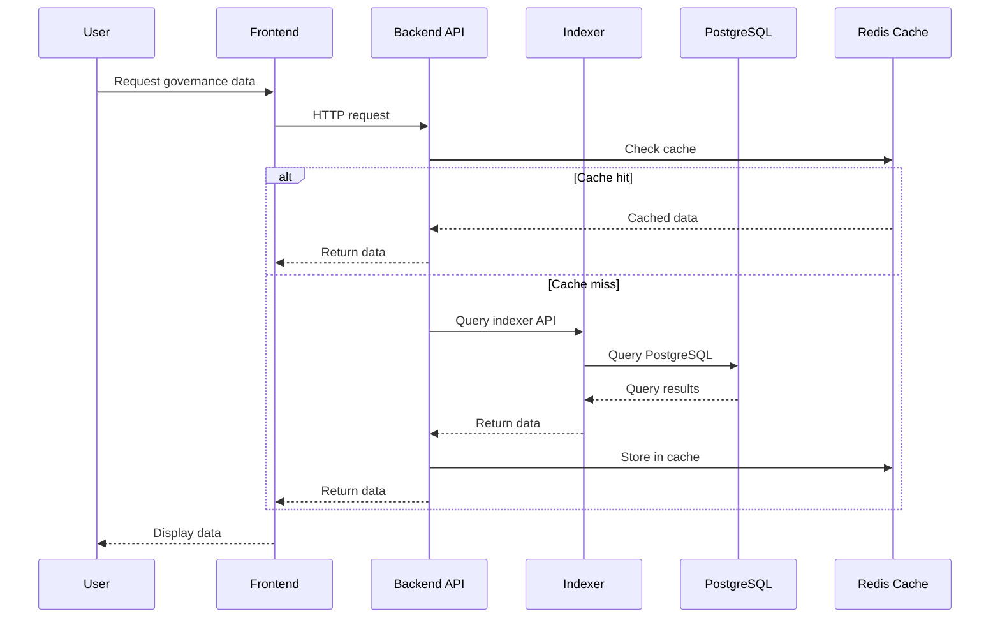
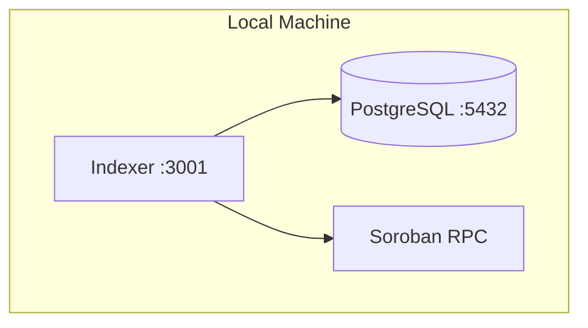
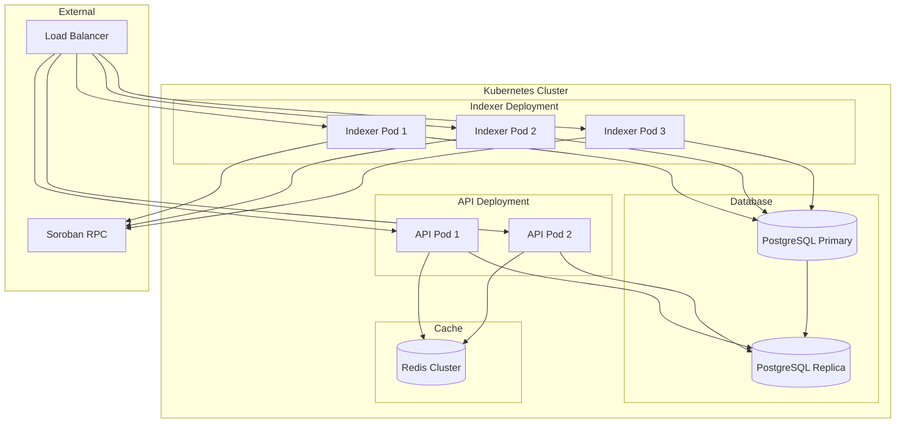

# NebGov System Architecture

This document describes the high-level architecture of the NebGov governance system, including all components and their interactions.

## System Overview

NebGov is a decentralized governance platform built on Stellar that enables on-chain proposal creation, voting, and execution. The system consists of smart contracts deployed on the Stellar network and off-chain services that index and analyze governance data.

## Architecture Diagram

## Components

### Stellar Smart Contracts

#### Governor Contract
The core governance contract that manages:
- Proposal creation and validation
- Voting mechanism (for, against, abstain)
- Proposal execution
- Configuration management
- Delegation system

**Key Events:**

- `ProposalCreated`: New proposal submitted
- `VoteCast` / `VoteCastWithReason`: Vote recorded
- `ProposalQueued`: Proposal queued for execution
- `ProposalExecuted`: Proposal executed successfully
- `ProposalCancelled`: Proposal cancelled
- `DelegateChanged`: Voting delegation updated
- `ConfigUpdated`: Governance parameters changed
- `GovernorUpgraded`: Contract upgraded

#### Wrapper Contract
Token wrapper that enables governance participation:
- Token deposits and withdrawals
- Delegation via wrapper
- Voting power calculation

**Key Events:**
- `Deposit`: Tokens deposited
- `Withdraw`: Tokens withdrawn
- `DelegateChanged`: Delegation updated

#### Treasury Contract
Manages treasury funds and batch transfers:
- Multi-recipient transfers
- Token management
- Approval workflows

**Key Events:**
- `BatchTransfer`: Batch transfer executed

#### Liquidity Contract
Provides liquidity pool functionality:
- Liquidity provision
- Token swapping
- Fee management

**Key Events:**
- `LiquidityAdded`: Liquidity provided
- `LiquidityRemoved`: Liquidity removed
- `Swap`: Token swap executed
- `PoolFeeUpdated`: Fee updated

#### Vote-Escrow Contract
A second source of voting weight alongside `token-votes` (`contracts/vote-escrow/`). Users lock the underlying
token for a chosen number of ledgers and receive voting power boosted by lock length.

- `create_lock`, `increase_lock_amount`, `extend_lock`, `withdraw` manage a single lock per owner
- Power starts at `amount` plus a boost of up to `max_multiplier_bps` (scaled by lock duration between
  `min_lock_duration` and `max_lock_duration`) and decays linearly back to `amount` as `end_ledger` approaches
- `get_votes`, `get_past_votes` and `get_past_total_supply` expose current and snapshot power, so a lock's power at
  a proposal's snapshot ledger can be recomputed later; `get_lock` and `get_lock_history` expose lock records
- `update_escrow_config` (admin) changes the duration bounds and the multiplier

**Depends on:** only the locked token (a SEP-41 token contract). It does not call the governor or `token-votes`.

**Read by:** any contract or client that calls its `get_past_votes` / `get_past_total_supply`. The governor does
this when the contract is configured as a voting-weight source (see
[Voting-weight sources](#voting-weight-sources)); the SDK's `VoteEscrowClient`, the CLI's `vote-escrow` command and
the frontend lock views read it directly.

**Key Events:**
- `LockCreated`: New lock created
- `LockIncreased`: Lock amount increased
- `LockExtended`: Lock end ledger extended
- `LockWithdrawn`: Locked tokens withdrawn

#### Voting-Rewards Contract
Pays voters for participating (`contracts/voting-rewards/`). A funded token pool is split per epoch across the
addresses that voted, in proportion to the voting power they cast.

Eligibility is computed off-chain and only a Merkle root goes on-chain, so the governor is untouched and no
unbounded per-epoch voter list is stored:

1. The backend job (`backend/src/jobs/voting-rewards-epoch.ts`) reads the indexer's `votes` table for an ended epoch,
   builds `(address, amount)` leaves and a Merkle tree.
2. The root is published with `publish_epoch_root`, which is admin-only. The admin is intended to be the governor's
   own address, so publishing a root is a governance-executed action rather than a trusted operator key.
3. Each voter calls `claim` with a Merkle proof for their leaf; a claim marker prevents double claims.

- `initialize(admin, reward_token, epoch_duration_ledgers)` opens epoch 0; `start_next_epoch` is permissionless once
  the current epoch has ended
- `fund_pool` adds reward tokens; `get_available_pool` is the balance not yet allocated to a published epoch
- `sweep_epoch` (admin) returns an epoch's unclaimed rewards to the available pool
- `set_admin` and `update_epoch_duration` (admin) rotate the admin and change the duration of future epochs

**Depends on:** only the reward token (a SEP-41 token contract). Its admin should be set to the governor, so it must
be deployed and initialized after the governor (`scripts/deploy-testnet.sh` does this).

**Read by:** the backend epoch job, the SDK's `VotingRewardsClient`, the CLI's `voting-rewards` command and the
frontend `/rewards` route.

**Key Events:**
- `EpochStarted`: New epoch opened
- `EpochRootPublished`: Merkle root published and rewards allocated
- `RewardClaimed`: Voter claimed a reward
- `PoolFunded`: Tokens added to the pool
- `EpochSwept`: Unclaimed rewards returned to the pool

### Voting-weight sources

The governor reads voting weight through a three-method interface on the contract it is pointed at:
`get_votes`, `get_past_votes` and `get_past_total_supply` (plus `token`). It has no vote-escrow-specific code.
`token-votes` and `vote-escrow` both implement that interface, which is what makes vote-escrow usable as a source.
The governor's `VotingStrategy` decides how sources are combined:

| Strategy | Behavior |
|---|---|
| `Single` (default) | Weight and quorum supply come from the one `votes_token` address set at `initialize`. Point it at `token-votes` for token-balance voting. |
| `MultiToken(Vec<WeightedToken>)` | Weight is the sum over up to 5 sources of `get_past_votes(source) * weight_bps / 10000`, and quorum supply is summed the same way. List `token-votes` and `vote-escrow` together to compose them. |

So the two sources can either **compose** (`MultiToken` with both listed and a weight for each) or **replace** each
other (a `Single` strategy pointing at one of them). Voting weight is always read at the proposal's snapshot ledger,
which is why vote-escrow keeps lock history and global checkpoints. Changing the strategy is done with
`set_voting_strategy`, which requires the governor's own authorization, so it goes through a governance proposal.
Under `MultiToken`, a source that errors is counted as zero rather than failing the vote.

### Indexer Service

The indexer service (`packages/indexer/`) is responsible for:
- **Event Streaming**: Continuously polls the Stellar Soroban RPC for new governance events
- **Data Storage**: Processes and stores events in PostgreSQL
- **Real-time Notifications**: Broadcasts events via WebSocket to connected clients
- **API Endpoints**: Provides REST API for querying governance data

**Key Components:**
- **Event Processor** (`src/events.ts`): Fetches and processes events from Stellar RPC
- **REST API Server** (`src/api.ts`): Express server with HTTP endpoints
- **WebSocket Server** (`src/ws.ts`): Real-time event broadcasting
- **Cache Layer** (`src/cache.ts`): In-memory caching for performance
- **Database Layer** (`src/db.ts`): PostgreSQL connection and migrations

**Configuration:**
- Polls Stellar RPC every 5 seconds (configurable via `POLL_INTERVAL_MS`)
- Tracks last indexed ledger for resumption
- Supports multiple contract addresses (governor, wrapper, treasury, liquidity)

**API Endpoints:**
- `GET /health`: Health check and indexing progress
- `GET /stats`: Aggregate governance statistics
- `GET /proposals`: List proposals with pagination
- `GET /proposals/:id`: Single proposal details
- `GET /proposals/:id/votes`: Proposal votes
- `GET /delegates`: Delegation leaderboard
- `GET /profile/:address`: Address governance profile
- `GET /wrapper/deposits`: Wrapper deposit history
- `GET /wrapper/withdrawals`: Wrapper withdrawal history
- `GET /treasury/transfers`: Treasury transfer history
- `GET /streams`: Budget streams, optionally filtered by owner
- `GET /streams/:id`: Current budget-stream state
- `GET /streams/:id/spends`: Complete stream spend history
- `GET /treasury/stream-events`: Stream lifecycle history
- `GET /treasury/budget-summary`: Token-grouped stream budget totals
- `GET /config-history`: Configuration change history
- `GET /upgrade-history`: Governor upgrade history
- `GET /leaderboard/voters`: Voter participation leaderboard

**WebSocket Events:**
- Real-time broadcasts for all governance events
- Client-side filtering by event type or proposal ID
- Subscription-based model

See [packages/indexer/README.md](../packages/indexer/README.md) for detailed indexer documentation.

### Backend API

The backend API serves as the primary interface for the frontend application:
- Aggregates data from the indexer
- Implements business logic
- Handles authentication and authorization
- Provides optimized queries for frontend use

### Frontend Web App

The web application provides user interface for:
- Viewing proposals and voting
- Managing delegations
- Analyzing governance data
- Real-time updates via WebSocket

### Data Storage

#### PostgreSQL
Primary database for indexed governance data:
- Proposals and votes
- Delegation history
- Configuration changes
- Treasury transfers
- Indexer state

#### Redis Cache
Caching layer for frequently accessed data:
- Proposal lists
- Vote tallies
- Statistics
- Profile data

### External Services

#### Soroban RPC
Stellar network RPC endpoint:
- Provides access to ledger data
- Event streaming
- Contract state queries

## Data Flow

### Event Indexing Flow

### User Query Flow

## Deployment Architecture

### Development Environment

### Production Environment

## Security Considerations

### Indexer Security
- Rate limiting on API endpoints (100 req/15min general, 30 req/15min sensitive)
- Input validation on all API endpoints
- PostgreSQL connection pooling
- Environment variable-based configuration
- Non-root user in Docker containers

### Smart Contract Security
- Guardian address for emergency operations
- Time-locked proposal execution
- Quorum requirements for proposals
- Vote weight validation

## Monitoring and Observability

### Health Checks
- Indexer `/health` endpoint provides:
  - Ledger lag metrics
  - Indexed counts
  - Service uptime
  - Status (ok/degraded)

### Logging
- Event processing logs
- Error tracking
- Performance metrics
- Database query logs

### Metrics
- Request latency
- Event processing rate
- Database query performance
- Cache hit rates

## Scalability

### Horizontal Scaling
- Indexer: Can run multiple instances (only one should index to avoid duplication)
- API: Stateless, can scale horizontally
- Database: Read replicas for query scaling

### Vertical Scaling
- Increase PostgreSQL resources for larger datasets
- Increase cache size for better hit rates
- Adjust poll interval based on network activity

## Disaster Recovery

### Database Backups
- Regular PostgreSQL backups
- Point-in-time recovery capability
- Backup replication to separate region

### Indexer Recovery
- Indexer state stored in `indexer_state` table
- Automatic resumption from last indexed ledger
- No data loss on restart

## Future Enhancements

### Planned Features
- Multi-chain support
- Advanced analytics and reporting
- Mobile application
- Governance notifications
- Proposal templates

### Architecture Improvements
- Event streaming via WebSocket instead of polling
- GraphQL API for flexible queries
- Message queue for event processing
- Distributed tracing for observability
